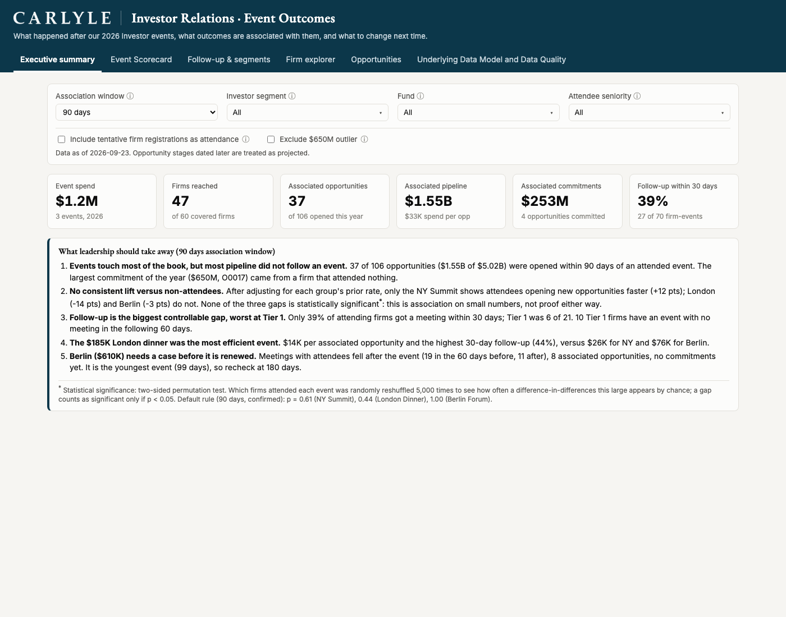

# Investor Event Outcomes

**Question from leadership:** What happened after our investor events, what business outcomes are associated with them, and what should we learn for future events?

**Live dashboard:** https://colinbayer77.github.io/carlyle-ir-event-analytics/ (static, no install)
**Executive readout (3 slides):** [readout/exec_readout.pdf](readout/exec_readout.pdf)
**How AI was used and checked:** [AI_USAGE.md](AI_USAGE.md)
**Method, metric definitions, data-quality decisions:** [docs/METHOD.md](docs/METHOD.md)



## The answer in five points

1. **Events reach most priority firms (13 of 17 Tier 1, 47 of 60 overall) for $1.2M.** 37 of 106 opportunities ($1.55B, 31% of 2026 pipeline, $253M committed) opened within 90 days of an event the firm attended.
2. **That is association, not demonstrated lift.** Against firms that did not attend, over the same dates, attendees did not open opportunities faster (difference-in-differences: NY +12 pts, London -14, Berlin -3). None is statistically significant\*.

   \* Two-sided permutation test, 5,000 random reshuffles of which firms attended; significant only if p < 0.05. p = 0.61 (NY), 0.44 (London), 1.00 (Berlin).
3. **Follow-up is the biggest controllable gap, worst at Tier 1.** 39% of attending firms had a meeting within 30 days; Tier 1 was 6 of 21. Ten Tier 1 firms with $808M of pipeline attended and were not met in the following 60 days.
4. **The $185K London dinner was the most efficient event:** $14K per associated opportunity vs $26K for NY and $76K for Berlin, and the largest rise in post-event meetings.
5. **Berlin ($610K) needs a case before renewal:** meetings with attendees fell after the event (19 to 11), no commitments yet. Recheck at 180 days.

Recommendations (readout slide 3): a 10-day Tier 1 follow-up standard, shift budget toward hospitality formats, capture source-event and check-in data, and design the next events with a matched holdout so lift can be measured.

## What is in the repo

```
assets/                 Carlyle logo (navy and white)
data/raw/               source CSVs, untouched
sql/01_staging.sql      type casting, dedupe, DQ flags
sql/02_core.sql         dimensions and facts (event, firm, firm x event, meeting, opportunity)
sql/03_marts.sql        association bridge, sensitivity grid, KPI and explorer marts
src/build.py            runs the SQL in DuckDB, DQ checks, exports marts + docs/data.js
src/dq_checks.py        10 logged findings, 11 build-breaking assertions
app/metrics.py          filter-aware KPI engine (docs/metrics.js is the JS port)
tests/                  engine-vs-SQL and Streamlit filter tests
notebooks/analysis.ipynb  independent pandas recomputation vs SQL, sensitivity, permutation test
docs/index.html         static dashboard (GitHub Pages)
app/streamlit_app.py    same dashboard in Streamlit, reading the same marts
readout/                3-slide executive readout (PDF + HTML source + generator)
screenshots/            dashboard screenshots
```

## Data model

```
dim_event ─┐                         ┌─ dim_firm
           ├─ fct_firm_event (firm x event: confirmed?, contacts, senior?)
           │
           ├─ bridge_opp_event (window x tentative rule x opportunity → credited event, last touch)
           │
fct_meeting (firm, date, type, purpose)      fct_opportunity (one row per opp: stage reached, outcome, as-of status)
                                                  └─ stg_opp_stage (deduped stage history, projected flag)
```

Marts: `mart_event_kpis` (3 events x 4 windows x 2 tentative rules), `mart_firm_event`, `mart_firm`, `mart_opportunity`, `mart_firm_timeline`, `mart_segment`, `dq_log`.

## Run it

Requires Python 3.10+ (tested on 3.11).

```bash
python -m venv .venv && source .venv/bin/activate
pip install -r requirements.txt
python src/build.py                      # builds DuckDB, runs DQ checks, exports marts
```

Static dashboard (no server needed; `docs/data.js` is bundled):

```bash
open docs/index.html
```

Streamlit version:

```bash
streamlit run app/streamlit_app.py
```

Tests (filter engine matches SQL; Streamlit runs under every filter):

```bash
python tests/test_metrics.py
python tests/test_streamlit_app.py
```

Regenerate the notebook and readout:

```bash
python notebooks/make_notebook.py        # executes and saves notebooks/analysis.ipynb
python readout/build_readout.py          # needs Google Chrome for the PDF step
```

## Key assumptions (full list in [docs/METHOD.md](docs/METHOD.md))

- **Attended** means at least one Confirmed contact; tentative-only registrations can be counted with the "Include tentative firm registrations as attendance" toggle.
- **Associated** means the opportunity was created 0 to 90 days after an attended event; the most recent event gets credit. 30/60/180 days are available as sensitivities.
- **As-of date is 2026-09-23** (the data delivery date). 19 stage entries dated later (up to 2026-10-28) are treated as projected, not achieved.
- **One duplicate opportunity removed.** O9998 and O9999 are the same $25M Fund Beta commitment entered twice; O9998 is kept.
- The $650M commitment (O0017) is kept and flagged; it is not linked to any event.
- Every rate rests on 19 to 26 attending firms per event, so all findings are directional.

## Why this format

A static page on GitHub Pages lets a reviewer open the analysis with one click. The same marts feed a Streamlit app for anyone who prefers Python, and all logic lives in SQL so either front end is a thin view. With larger data or a live CRM feed, the same `sql/` layer would move to dbt on Snowflake or Databricks and the front end to Power BI or Tableau without changing the metric definitions.
